# Hops Ploidy Analysis

K-mer based ploidy estimation for *Humulus lupulus* (hops) samples using KMC and GenomeScope2.

## Biological Motivation

Ploidy — the number of complete chromosome sets in a cell — is a fundamental genomic property
with direct implications for breeding, genome assembly, and population genetics. *Humulus lupulus*
(common hop) is typically diploid (2n=20), but polyploid individuals have been documented. 
Accurate ploidy estimation is essential before downstream analyses such as variant calling or 
genome assembly, as tools and parameters differ substantially between diploid and polyploid genomes.

This pipeline provides a reference-free, sequencing-based approach to estimate ploidy across
large sample sets using k-mer frequency profiling.

## Pipeline



### Steps

1. **Quality trimming** — adapter removal and quality filtering with fastp
2. **K-mer counting** — count k-mers from paired-end reads using KMC (k=21)
3. **Histogram generation** — export k-mer frequency spectrum with kmc_tools
4. **Genome profiling** — fit a statistical model to the k-mer histogram using GenomeScope2 (p=2)
5. **Aggregation** — summarize homozygosity, heterozygosity, genome size, and inferred ploidy
   across all samples using the provided aggregation script

## Tools and Versions

| Tool | Version | Purpose |
|------|---------|---------|
| fastp | 1.3.4 | Quality trimming and adapter removal |
| KMC | 3.2.4 | K-mer counting |
| GenomeScope2 | 2.0 | Genome profiling and ploidy modeling |

## Cluster Setup

This analysis was run across two institutional HPC clusters with different job schedulers:

- **Cluster 1 (PBS/Torque)** — 40 samples; job script: `scripts/kmc_genomescope_array_pbs.pbs`
- **Cluster 2 (SLURM)** — 164 samples; job script: `scripts/kmc_genomescope_array_slurm.slurm`

Both scripts run the same pipeline (KMC → histogram → GenomeScope2) but differ in scheduler
syntax (`#PBS` vs `#SBATCH`), array task variable (`PBS_ARRAYID` vs `SLURM_ARRAY_TASK_ID`),
and resource request format. The conda environment (`genomescope_env`) was set up independently
on each cluster using miniconda3/miniforge3.

## Environment Setup

All tools were run within a conda environment. To reproduce:

```bash
conda create -n genomescope_env python=3.10 -y
conda activate genomescope_env

# Install KMC
# Download precompiled binary from https://github.com/refresh-bio/KMC/releases
# KMC v3.2.4 linux x64 binary was used

# Install GenomeScope2 R dependencies
conda install -c conda-forge r-base=4.2 -y
R -e 'install.packages(c("argparse", "minpack.lm"), repos="https://cran.r-project.org")'

# Clone and install GenomeScope2
git clone https://github.com/tbenavi1/genomescope2.0.git
cd genomescope2.0 && Rscript install.R

# Add GenomeScope2 to PATH
export PATH=/path/to/genomescope2.0:$PATH

# Install smudgeplot dependencies and smudgeplot
conda install -c conda-forge numpy pandas matplotlib -y
pip install smudgeplot --no-deps
```

### Notes
- KMC was installed as a precompiled binary due to glibc version constraints on the clusters
- GenomeScope2 requires Rscript to be in PATH — activate the conda environment before running
- Smudgeplot v0.5.3 was installed but ultimately not used due to insufficient sequencing 
  coverage (~15-20x) for reliable heterozygous k-mer pair detection


## Repository Structure

- `scripts/` — job submission and aggregation scripts
- `results/` — per-batch TSV summary tables

## Key Findings

- Majority of samples consistent with diploidy (homozygosity ~89-96%, heterozygosity ~5-9%)
- Samples with genome size estimates < ~200 Mb flagged as potential polyploids
- Samples with genome size estimates > ~950 Mb flagged for further inspection
- Absolute genome size estimates (~550-780 Mb) are lower than the published haploid size
  (~2.5 Gb for *H. lupulus*), likely an artifact of high repeat content (~78-84%) and
  moderate sequencing depth

## Caveats

Heterozygosity estimates and relative genome size comparisons between samples remain
interpretable for ploidy inference despite the absolute size underestimation.

